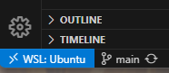
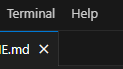

# Open Enviroment

## 1. Open VScode and connect to WSL Ubuntu:

* Missibg tutorial on how to connect by WSL to  Ubuntu, if are already using a linux machine this step is not needed.



## 2. Open terminal inside VScode:



## 3. Open *user* folder:

> **Obs:** *home* folder has security blockages in linux (belongs to root user).

```bash
$ cd ~/<user>
``` 
## 4. Create *haskell-projects* folder inside it.

```bash
$ mkdir <haskell-projects>
```
## 5. Open *haskell-projects* folder inside it.

```bash
$ cd <haskell-projects>
```

# Install GHCup (Haskell package manager):

**Install GHCup**:
```bash
$ curl https://get-ghcup.haskell.org | sh
```

**Install HLS**:
```bash
$ ghcup tui
```
Then install (by selecting with arrows and pressing `i`, and after installed set as default by pressing `s`):
* Stack 2.11.1
* HLS 2.0.0.0
* GHC 9.4.5

# Create project

## 3. Create *project*:

```bash
$ stack new project-test simple
```

## 4. Verify TLS-VHC version:

```bash
$ stack new project-test simple
```

## 5. Build project:

```bash
$ stack build
```

## 6. Run project:

```bash
$ stack run
```
